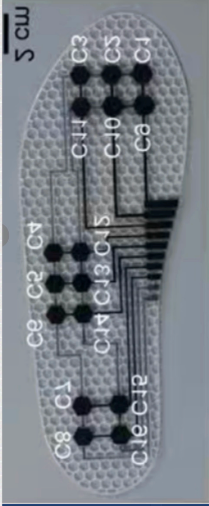
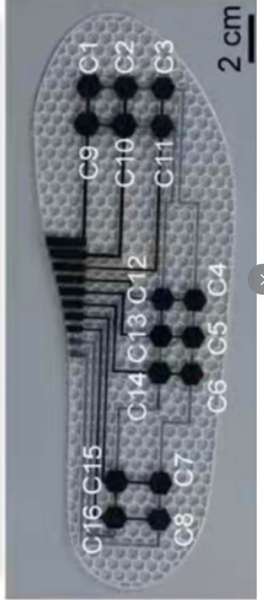
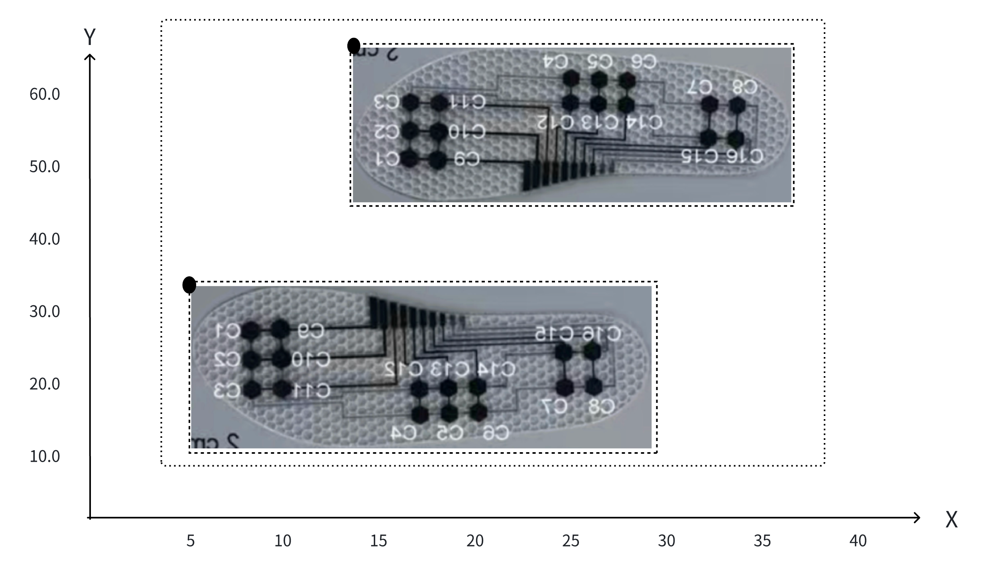

# 鞋垫压力中心计算器

## 简介

本项目使用力科公司RPPS-16产品进行压力采集。现阶段通过数据模拟以跳过 将压力数据从通信帧中进行提取阶段。每个鞋垫其十六个传感器分布位置如下图所示。

  
  

## 坐标系确定
现阶段坐标系为平面坐标系，测试压力时会有一矩形测试区域，以测试区域左下角为原点，建立平面坐标系。 
传感器坐标确立
1. 由于鞋垫是不规则形状，想要直接控制其整个坐标较困难。而由于鞋垫大小且传感器的位置均为固定，则可以提前计算出每个鞋垫所在最小矩形区域，并通过左上角坐标以及每个鞋垫传感器坐标映射规则便可推出所有传感器坐标
2. 现阶段映射规则较为简单，设置一个internal变量，映射规则为
    1. 第一个传感器坐标C1/C3为小矩形左上角坐标横坐标加3个internal，纵坐标减4个internal
    2. C12、C13、C14与C11、C3以及C7、C8位于同一直线上，所以只需拿到该条直线公式即可，但现版本并未实现该直线公式，仅仅只是变化纵坐标。
    3. 相邻传感器的变化仅仅只是横/纵坐标变化了一个internal

## 压力中心坐标计算方法 ()  
使用传统的压力加权平均法：  

   

     
   

其中，  
 
是传感器的压力值，  
 
是传感器的坐标。

---
## 压力中心数值计算方法

**传感器到压力中心的距离 $d_i$** 的计算：  
   计算每个传感器到压力中心的欧几里得距离：  
   

     
   

  
 
   这个距离反映了传感器与压力中心的空间关系。
    

**等效压力值 $F_{\text{COP}}$ 的计算**：  
   使用修正后的距离 \(d_i\) 计算等效压力值：
   

     
   
  
   其中，$\epsilon = 0.001$ 用于避免除零错误。

---

### 修正后的物理意义

- **压力中心坐标 **：反映了足底压力的空间分布中心。  
- **等效压力值 **：结合了压力值和传感器到压力中心的距离，能够更好地反映压力分布的集中程度。  
  - 高压力值且靠近压力中心的传感器对结果贡献更大。  
  - 低压力值或远离压力中心的传感器对结果贡献较小。

